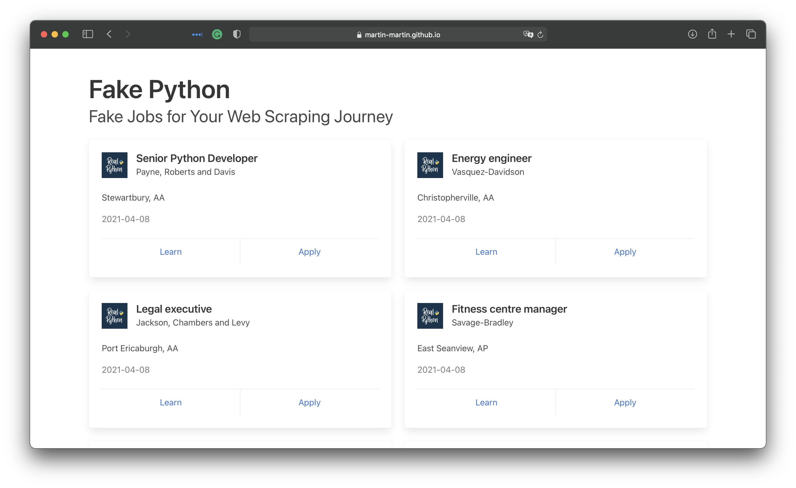

The incredible amount of data on the Internet is a rich resource for any field of research or personal interest. To effectively harvest that data, you'll need to become skilled at [**web scraping**](https://realpython.com/python-web-scraping-practical-introduction/). The Python libraries `requests` and Beautiful Soup are powerful tools for the job. If you like to learn with hands-on examples and you have a basic understanding of Python and HTML, then this tutorial is for you.

**In this tutorial, you'll learn how to:**

- Use `requests` and Beautiful Soup for **scraping and parsing data** from the Web
- Walk through a **web scraping pipeline** from start to finish
- **Build a script** that fetches job offers from the Web and displays relevant information in your console

This is a powerful project because you'll be able to apply the same process and the same tools to any static website out there on the World Wide Web. You can download the source code for the project and all examples in this tutorial by clicking on the link below:



Let's get started!

## What Is Web Scraping?

**Web scraping** is the process of gathering information from the Internet. Even copy-pasting the lyrics of your favorite song is a form of web scraping! However, the words "web scraping" usually refer to a process that involves automation. Some websites don't like it when automatic scrapers gather their data, while others don't mind. 

If you're scraping a page respectfully for educational purposes, then you're unlikely to have any problems. Still, it's a good idea to do some research on your own and make sure that you're not [violating](https://benbernardblog.com/web-scraping-and-crawling-are-perfectly-legal-right/) any Terms of Service before you start a large-scale project. To learn more about the legal aspects of web scraping, check out [Legal Perspectives on Scraping Data From The Modern Web](https://www.lawinsociety.org/legal-perspectives-on-scraping-data-from-the-modern-web).

### Why Scrape the Web?

Say you're a surfer (both online and in real life) and you're looking for employment. However, you're not looking for just _any_ job. With a surfer's mindset, you're waiting for the perfect opportunity to roll your way!

There's a job site that you like that offers exactly the kinds of jobs you're looking for. Unfortunately, a new position only pops up once in a blue moon. You think about checking up on it every day, but that doesn't sound like the most fun and productive way to spend your time.

Thankfully, the world offers other ways to apply that surfer's mindset! Instead of looking at the job site every day, you can use Python to help automate the repetitive parts of your job search. **Automated web scraping** can be a solution to speed up the data collection process. You write your code once and it will get the information you want many times and from many pages.

In contrast, when you try to get the information you want manually, you might spend a lot of time clicking, scrolling, and searching. This is especially true if you need large amounts of data from websites that are regularly updated with new content. Manual web scraping can take a lot of time and repetition.

There's so much information on the Web, and new information is constantly added. Something among all that data is likely of interest to you, and much of it is just out there for the taking. Whether you're actually on the job hunt, gathering data to support your grassroots organization, or are finally looking to get all the lyrics from your favorite artist downloaded to your computer, automated web scraping can help you accomplish your goals.

### Challenges of Web Scraping

The Web has grown organically out of many sources. It combines a ton of different technologies, styles, and personalities, and it continues to grow to this day. In other words, the Web is kind of a hot mess! This can lead to a few challenges you'll see when you try web scraping.

One challenge is **variety**. Every website is different. While you'll encounter general structures that tend to repeat themselves, each website is unique and will need its own personal treatment if you want to extract the information that's relevant to you.

Another challenge is **durability**. Websites constantly change. Say you've built a shiny new web scraper that automatically cherry-picks precisely what you want from your resource of interest. The first time you run your script, it works flawlessly. But when you run the same script only a short while later, you run into a discouraging and lengthy stack of [tracebacks](https://realpython.com/python-traceback/)!

This is a realistic scenario, as many websites are in active development. Once the site's structure has changed, your scraper might not be able to navigate the sitemap correctly or find the relevant information. The good news is that many changes to websites are small and incremental, so you'll likely be able to update your scraper with only minimal adjustments.

However, keep in mind that because the internet is dynamic, the scrapers you'll build will probably require constant maintenance. You can set up [continuous integration](https://realpython.com/python-continuous-integration/) to run scraping tests periodically to ensure that your main script doesn't break without your knowledge.

### APIs: An Alternative to Web Scraping

Some website providers offer **Application Programming Interfaces (APIs)** that allow you to access their data in a predefined manner. With APIs, you can avoid parsing HTML and instead access the data directly using formats like [JSON](https://realpython.com/courses/working-json-data-python/) and XML. HTML is primarily a way to visually present content to users.

When you use an [API](https://realpython.com/python-api/), the process is generally more stable than gathering the data through web scraping. That's because APIs are made to be consumed by programs, rather than by human eyes. If the design of a website changes, then it doesn't mean that the structure of the API has changed.

However, APIs *can* change as well. Both the challenges of variety and durability apply to APIs just as they do to websites. Additionally, it's much harder to inspect the structure of an API by yourself if the provided documentation is lacking in quality.

The approach and tools you need to gather information using APIs are outside the scope of this tutorial. To learn more about it, check out [API Integration in Python](https://realpython.com/api-integration-in-python/).

## Scraping the Fake Python Job Site
<!-- TODO: Add the right link once the site is live on a realpython domain -->
In this tutorial, you'll build a web scraper that fetches Python Software Developer job listings from the [Fake Python Jobs](https://martin-martin.github.io/fake-jobs/) site. This is an example site with fake job postings that you can freely scrape to train your skills. Your web scraper will parse the HTML on the site to pick out the relevant pieces of information and filter that content for specific words.

You can scrape any site on the Internet that you can look at, but the difficulty of doing so depends on the site. This tutorial offers you an introduction to web scraping to help you understand the overall process. Then, you can apply this same process for every website you'll want to scrape.

## Part 1: Inspect Your Data Source

The first step is to head over to the site you want to scrape using your favorite browser. You'll need to understand the site structure to extract the information you're interested in.

### Explore the Website

Click through the site and interact with it just like any normal user would. For example, you can scroll through the main page of the website:


<!-- TODO: replace with screenshot -->
<!--  -->

You can see a lot of job postings in a card format, and each of them has two buttons. If you click on the _Apply_ button, you'll see a new page that contains more detailed descriptions about the selected job. You might also notice that the URL in your browser's address bar changes when you interact with the website.

### Decipher the Information in URLs

A lot of information can be encoded in a URL. Your web scraping journey will be much easier if you first become familiar with how URLs work and what they're made of. For example, you might find yourself on a detail page that has the following URL:

<!-- TODO: replace with real link -->
```text
https://martin-martin.github.io/fake-jobs/jobs/senior-python-developer-0.html
```

You can deconstruct the above URL into two main parts:

1. **The base URL** represents the path to the search functionality of the website. In 
<!-- TODO: replace link -->
the example above, the base URL is `https://martin-martin.github.io/fake-jobs/`.
2. **The specific site location** that ends with `.html` is the path to the individual resource where the job description is posted.

Any job you'll on this website will use the same base URL. However, the location of the individual resources will change depending on what job you're looking at.

URLs can hold even more information than the location of a file. Some websites use **query parameters** to encode values that you might enter when searching for a specific job. You can think of them as query strings that get sent to the database to retrieve specific records. Query parameters will follow at the end of the URL. For example, if you make a search for _Software Developer_ in _Australia_ on [indeed.com](https://au.indeed.com), you'll see that the URL includes these values as query parameters:

```text
https://au.indeed.com/jobs?q=software+developer&l=Australia
```

The query parameters in this URL are `?q=software+developer&l=Australia`. They generally consist of three parts:

1. **Start:** The beginning of the query parameters is denoted by a question mark (`?`).
2. **Information:** The pieces of information constituting one query parameter are encoded in key-value pairs, where related keys and values are joined together by an equals sign (`key=value`).
3. **Separator:** Every URL can have multiple query parameters, which are separated from each other by an ampersand symbol (`&`).

Equipped with this information, you can pick apart the URL's query parameters into two key-value pairs:

1. **`q=software+developer`** selects the type of job you're looking for.
2. **`l=Australia`** selects the location you're looking for.

Try to change the search parameters and observe how that affects your URL. Go ahead and enter new values in the search bar up top:

<!-- TODO: replace images -->


Next, try to change the values directly in your URL. See what happens when you paste the following URL into your browser's address bar:

```text
https://au.indeed.com/jobs?q=programmer&l=adelaide
```

You'll notice that changes in the search box of the site are directly reflected in the URL's query parameters and vice versa. If you change either of them, then you'll see different results on the website.

As you can see, exploring the URLs of a site can give you insight on how to retrieve data from the website's server.

<!-- TODO: change URL -->
Head back to [Fake Python Jobs](https://martin-martin.github.io/fake-jobs/) and continue to explore the option on this site. This site is a purely static website that doesn't operate on top of a database, which is why you won't have to work with query parameters in this scraping exercise.

### Inspect the Site Using Developer Tools

Next, you'll want to learn more about how the data is structured for display. You'll need to understand the page structure to pick what you want from the HTML response that you'll collect in one of the upcoming steps.

**Developer tools** can help you understand the structure of a website. All modern browsers come with developer tools installed. In this tutorial, you'll see how to work with the developer tools in Chrome. The process will be very similar to other modern browsers.

In Chrome, you can open up the developer tools through the menu *View → Developer → Developer Tools*. You can also access them by right-clicking on the page and selecting the *Inspect* option, or by using a keyboard shortcut.

Developer tools allow you to interactively explore the site's [DOM](https://en.wikipedia.org/wiki/Document_Object_Model) to better understand the source that you're working with. To dig into your page's DOM, select the *Elements* tab in developer tools. You'll see a structure with clickable HTML elements. You can expand, collapse, and even edit elements right in your browser:

<!-- TODO: Replace image -->


You can think of the text displayed in your browser as the HTML structure of that page. If you're interested, then you can read more about the difference between the DOM and HTML on [CSS-TRICKS](https://css-tricks.com/dom/).

When you right-click elements on the page, you can select *Inspect* to zoom to their location in the DOM. You can also hover over the HTML text on your right and see the corresponding elements light up on the page.


**Task:** Find a single job posting. What HTML element is it wrapped in, and what other HTML elements does it contain?


Play around and explore! The more you get to know the page you're working with, the easier it will be to scrape it. However, don't get too overwhelmed with all that HTML text. You'll use the power of programming to step through this maze and cherry-pick only the interesting parts with Beautiful Soup.

## Part 2: Scrape HTML Content From a Page

Now that you have an idea of what you're working with, it's time to get started using Python. First, you'll want to get the site's HTML code into your Python script so that you can interact with it. For this task, you'll use Python's [`requests`](https://realpython.com/python-requests/) library. Type the following in your terminal to install it:

```console
$ python3 -m pip install requests
```

Then open up a new file in your favorite [text editor](https://realpython.com/python-ides-code-editors-guide/). All you need to retrieve the HTML are a few lines of code:

```python
import requests

URL = 'https://www.monster.com/jobs/search/?q=Software-Developer&where=Australia'
page = requests.get(URL)
```

This code performs an [HTTP request](https://realpython.com/courses/python-requests/) to the given URL. It retrieves the HTML data that the server sends back and stores that data in a Python object.

If you take a look at the downloaded content, then you'll notice that it looks very similar to the HTML you were inspecting earlier with developer tools. To improve the structure of how the HTML is displayed in your console output, you can print the object's `.content` attribute with [`pprint()`](https://docs.python.org/3/library/pprint.html).

### Static Websites

The website you're scraping in this tutorial serves **static HTML content**. In this scenario, the server that hosts the site sends back HTML documents that already contain all the data that you'll get to see as a user.

When you inspected the page with developer tools earlier on, you discovered that a job posting consists of the following long and messy-looking HTML:

<!-- TODO: Update links -->
```html
<div class="card">
  <div class="card-content">
    <div class="media">
      <div class="media-left">
        <figure class="image is-48x48">
          
        </figure>
      </div>
      <div class="media-content">
        <h2 class="title is-5">Senior Python Developer</h2>
        <h3 class="subtitle is-6 company">Payne, Roberts and Davis</h3>
      </div>
    </div>

    <div class="content">
      <p class="location">
        Stewartbury, AA
      </p>
      <p class="is-small has-text-grey">
        <time datetime="2021-04-08">2021-04-08</time>
      </p>
    </div>
    <footer class="card-footer">
        <a href="https://www.realpython.com" target="_blank" class="card-footer-item">Learn</a>
        <a href="https://martin-martin.github.io/fake-jobs/jobs/senior-python-developer-0.html" target="_blank" class="card-footer-item">Apply</a>
    </footer>
  </div>
</div>
```

It can be difficult to wrap your head around such a long block of HTML code. To make it easier to read, you can use an [HTML formatter](https://htmlformatter.com/) to automatically clean it up a little more. Good readability helps you better understand the structure of any code block. While it may or may not help to improve the formatting of the HTML, it's always worth a try.


**Note:** Keep in mind that every website will look different. That's why it's necessary to inspect and understand the structure of the site you're currently working with before moving forward.


The HTML you'll encounter will sometimes be confusing. Luckily, the HTML you're working with in this tutorial has descriptive **class names** on the elements that you're interested in:

- **`class="title is-5"`**: the title of the job posting
- **`class="subtitle is-6 company"`**: the company that offers the position
- **`class="location"`**: the location where you'd be working

In case you ever get lost in a large pile of HTML, remember that you can always go back to your browser and use developer tools to further explore the HTML structure interactively.

By now, you've successfully harnessed the power and user-friendly design of Python's `requests` library. With only a few lines of code, you managed to scrape the static HTML content from the web and make it available for further processing.

However, there are a few more challenging situations you might encounter when you're scraping websites. Before you begin using Beautiful Soup to pick the relevant information from the HTML that you just scraped, take a quick look at two of these situations.

### Hidden Websites

Some pages contain information that's hidden behind a login. That means you'll need an account to be able to see (and scrape) anything from the page. The process to make an HTTP request from your Python script is different than how you access a page from your browser. That means that just because you can log in to the page through your browser, that doesn't mean you'll be able to scrape it with your Python script.

However, there are some advanced techniques that you can use with the [`requests`](https://realpython.com/python-requests/) to access the content behind logins. These techniques will allow you to log in to websites while making the HTTP request from within your script.

### Dynamic Websites

Static sites are easier to work with because the server sends you an HTML page that already contains all the information as a response. You can parse an HTML response with Beautiful Soup and begin to pick out the relevant data. 

On the other hand, with a **dynamic website** the server might not send back any HTML at all. Instead, you'll receive [JavaScript](https://realpython.com/python-vs-javascript/) code as a response. This will look completely different from what you saw when you inspected the page with your browser's developer tools.


**Note:** To offload work from the server to the clients' machines, many modern websites avoid crunching numbers on their servers whenever possible. Instead, they'll send **JavaScript** code that your browser will execute locally to produce the desired HTML.


As mentioned before, what happens in the browser is not related to what happens in your script. Your browser will diligently execute the JavaScript code it receives back from a server and create the DOM and HTML for you locally. However, doing a request to a dynamic website in your Python script will _not_ provide you with the HTML page content. 

When you use `requests`, you'll only receive what the server sends back. In the case of a dynamic website, you'll end up with some JavaScript code, which you won't be able to parse using Beautiful Soup. The only way to go from the JavaScript code to the content you're interested in is to **execute** the code, just like your browser does. The `requests` library can't do that for you, but there are other solutions that can. 

For example, `requests-html` is a project created by the author of the `requests` library that allows you to easily render JavaScript using syntax that's similar to the syntax in `requests`. It also includes capabilities for parsing the data by using Beautiful Soup under the hood.


**Note:** Another popular choice for scraping dynamic content is [**Selenium**](https://realpython.com/modern-web-automation-with-python-and-selenium/). You can think of Selenium as a slimmed-down browser that executes the JavaScript code for you before passing on the rendered HTML response to your script.


You won't go deeper into scraping dynamically-generated content in this tutorial. For now, it's enough for you to remember that you'll need to look into the above-mentioned options if the page you're interested in is generated in your browser dynamically.

## Part 3: Parse HTML Code With Beautiful Soup

You've successfully scraped some HTML from the Internet, but when you look at it now, it just seems like a huge mess. There are tons of HTML elements here and there, thousands of attributes scattered around---and wasn't there some JavaScript mixed in as well? It's time to parse this lengthy code response with Beautiful Soup to make it more accessible and pick out the data that you're interested in.

[Beautiful Soup](https://www.crummy.com/software/BeautifulSoup/bs4/doc/) is a Python library for **parsing structured data**. It allows you to interact with HTML in a similar way to how you would interact with a web page using developer tools. Beautiful Soup exposes a couple of intuitive functions you can use to explore the HTML you received. To get started, use your terminal to install the Beautiful Soup library:

```console
$ python3 -m pip install beautifulsoup4
```

Then, import the library and create a Beautiful Soup object:
<!-- TODO: Update URL -->
```python hl_lines="2 7"
import requests
from bs4 import BeautifulSoup

URL = 'https://martin-martin.github.io/fake-jobs/'
page = requests.get(URL)

soup = BeautifulSoup(page.content, 'html.parser')
```

When you add the two highlighted lines of code, you're creating a Beautiful Soup object that takes the HTML content you scraped earlier as its input. When you instantiate the object, you also instruct Beautiful Soup to use the appropriate parser.

### Find Elements by ID

In an HTML web page, every element can have an `id` attribute assigned. As the name already suggests, that `id` attribute makes the element uniquely identifiable on the page. You can begin to parse your page by selecting a specific element by its ID.

Switch back to developer tools and identify the HTML object that contains all of the job postings. Explore by hovering over parts of the page and using right-click to *Inspect*.


**Note:** Keep in mind that it's helpful to periodically switch back to your browser and interactively explore the page using developer tools. This helps you learn how to find the exact elements you're looking for.


At the time of this writing, the element you're looking for is a `<div>` with an `id` attribute that has the value `"ResultsContainer"`. It has a couple of other attributes as well, but below is the gist of what you're looking for:

```html
<div id="ResultsContainer">
    <!-- all the job listings -->
</div>
```

Beautiful Soup allows you to find that specific element easily by its ID:

```python
results = soup.find(id='ResultsContainer')
```

For easier viewing, you can `.prettify()` any Beautiful Soup object when you [print](https://realpython.com/python-print/) it out. If you call this method on the `results` variable that you just assigned above, then you should see all the HTML contained within the `<div>`:

```python
print(results.prettify())
```

When you use the element's ID, you're able to pick one element out from among the rest of the HTML. This allows you to work with only this specific part of the page's HTML. It looks like the soup just got a little thinner! However, it's still quite dense.

### Find Elements by HTML Class Name

You've seen that every job posting is wrapped in a `<div>` element with the class `card-content`. Now you can work with your new Beautiful Soup object called `results` and select only the job postings. These are, after all, the parts of the HTML that you're interested in! You can do this in one line of code:

```python
job_elems = results.find_all('div', class_='card-content')
```

Here, you call `.find_all()` on a Beautiful Soup object, which returns an [iterable](https://realpython.com/courses/python-for-loop/) containing all the HTML for all the job listings displayed on that page.

Take a look at all of them:

```python
for job_elem in job_elems:
    print(job_elem, end='\n'*2)
```

That's already pretty neat, but there's still a lot of HTML! You've seen earlier that your page has descriptive class names on some elements. Let's pick out only those:

```python hl_lines="4 5 6"
for job_elem in job_elems:
    # Each job_elem is a new BeautifulSoup object.
    # You can use the same methods on it as you did before.
    title_elem = job_elem.find('h2', class_='title')
    company_elem = job_elem.find('h3', class_='company')
    location_elem = job_elem.find('p', class_='location')
    print(title_elem)
    print(company_elem)
    print(location_elem)
    print()
```

Great! You're getting closer and closer to the data you're actually interested in. Still, there's a lot going on with all those HTML tags and attributes floating around:

```html
<h2 class="title is-5">Senior Python Developer</h2>
<h3 class="subtitle is-6 company">Payne, Roberts and Davis</h3>
<p class="location">
        Stewartbury, AA
      </p>
```

You'll see how to narrow down this output in the next section.

### Extract Text From HTML Elements

For now, you only want to see the title, company, and location of each job posting. And behold! Beautiful Soup has got you covered. You can add `.text` to a Beautiful Soup object to return only the **text content** of the HTML elements that the object contains:

```python hl_lines="5 6 7"
for job_elem in job_elems:
    title_elem = job_elem.find('h2', class_='title')
    company_elem = job_elem.find('h3', class_='company')
    location_elem = job_elem.find('p', class_='location')
    print(title_elem.text)
    print(company_elem.text)
    print(location_elem.text)
    print()
```

Run the above code snippet and you'll see the text content displayed. However, you might also get some extra [whitespace](https://realpython.com/lessons/whitespace-expressions-and-statements/). Since you're now working with [Python strings](https://realpython.com/python-strings/), you can `.strip()` the superfluous whitespace. You can also apply any other familiar Python string methods to further clean up your text.


**Note:** The web is messy and you can't rely on a page structure to be consistent throughout. Therefore, you'll more often than not run into errors while parsing HTML.


After you complete the above steps try running your script again. The results finally look much better:

```text
Senior Python Developer
Payne, Roberts and Davis
Stewartbury, AA

Energy engineer
Vasquez-Davidson
Christopherville, AA

Legal executive
Jackson, Chambers and Levy
Port Ericaburgh, AA
```

That's a readable list of jobs that also includes the company name and the location of each job. However, you're looking for a position as a software developer, and not all of these job postings are in that field.

### Find Elements by Class Name and Text Content

Not all of the job listings are developer jobs that you'd be interested in as a Python developer. So instead of printing out all of the jobs from the page, you'll first filter them using keywords.

You know that job titles in the page are kept within `<h2>` elements. To filter only for
specific jobs, you can use the [`string` argument](https://www.crummy.com/software/BeautifulSoup/bs4/doc/#the-string-argument):

```python
python_jobs = results.find_all('h2', string='Python Developer')
```

This code finds all `<h2>` elements where the contained string matches `'Python Developer'` exactly. Note that you're directly calling the method on your first `results` variable. If you go ahead and `print()` the output of the above code snippet to your console, then you might be disappointed because it will probably be empty:

```console
[]
```

There was definitely a Python job in the search results, so why is it not showing up? When you use `string=` like you did above, your program looks for _exactly_ that string. Any differences in capitalization or whitespace will prevent the element from matching. In the next section, you'll find a way to make your search string more general.

#### Pass a Function to a Beautiful Soup Method

In addition to strings, you can often pass functions as arguments to Beautiful Soup methods. You can change the previous line of code to use a function instead:

```python
python_jobs = results.find_all('h2',
                               string=lambda text: 'python' in text.lower())
```

Now you're passing an **anonymous function** to the `string=` argument. The [lambda function](https://realpython.com/python-lambda/) looks at the text of each `<h2>` element, converts it to lowercase, and checks whether the substring `'python'` is found anywhere in there. You can check whether you managed to identify the Python jobs:

```pycon
>>> print(len(python_jobs))
10
```

Your program has found `10` matching job posts that include the word `"python"` in their job title!

The process of finding specific elements depending on their text content is a powerful way to filter your HTML response for the information that you're looking for. Beautiful Soup allows you to use either exact strings or functions as arguments for filtering text in Beautiful Soup objects.

However, when you try to run your scraper to print out the information of the filtered Python jobs, you'll run into an error:

```python
AttributeError: 'NoneType' object has no attribute 'text'
```

This is a common error that you'll run into a lot when you're scraping information from the Internet. Inspect the HTML of an element in your `python_jobs` list. What do they look like? Where do you think the error is coming from?

### Identifying Error Conditions

When you look at a single element in `python_jobs`, you'll see that it consists only of the title element:

```html
<h2 class="title is-5">Senior Python Developer</h2>
```

When you filtered for job postings that contain the word `"python"` in their title, you picked out only the HTML elements that contain the title. As you can see, these elements don't contain the rest of the information about the job you're interested in.

The error message you received earlier was related to this:

```python
AttributeError: 'NoneType' object has no attribute 'text'
```

Beautiful Soup returns `None` if it can't find an element given your specifications. Because each element inside of `python_jobs` only consists of one `<h2>` element that has the job title text, you won't be able to find the company name or the location of the job in there. Beautiful Soup still looks for them, can't find them, returns `None` instead, and your `print()` then fails when you try to extract the `.text` attribute from one of these `None` objects.

The text that you're looking for is nested in sibling elements of the `<h2>` that you identified. Beautiful Soup can help you to select sibling, child, and parent elements of the HTML element you identified.

### Accessing Parent Elements

One way to get access to all the information you need is to use the `<h2>` elements that you identified and step up in the hierarchy of the DOM. Take another look at the HTML of a single job posting and find the `<h2>` element that contains the job title, as well as the closest parent element that contains all the information you're interested in:

```html hl_lines="2 10"
<div class="card">
  <div class="card-content">
    <div class="media">
      <div class="media-left">
        <figure class="image is-48x48">
          
        </figure>
      </div>
      <div class="media-content">
        <h2 class="title is-5">Senior Python Developer</h2>
        <h3 class="subtitle is-6 company">Payne, Roberts and Davis</h3>
      </div>
    </div>

    <div class="content">
      <p class="location">
        Stewartbury, AA
      </p>
      <p class="is-small has-text-grey">
        <time datetime="2021-04-08">2021-04-08</time>
      </p>
    </div>
    <footer class="card-footer">
        <a href="https://www.realpython.com" target="_blank" class="card-footer-item">Learn</a>
        <a href="https://martin-martin.github.io/fake-jobs/jobs/senior-python-developer-0.html" target="_blank" class="card-footer-item">Apply</a>
    </footer>
  </div>
</div>
```

The `<div>` element with the `card-content` class contains all the information that you want. It's a third-level parent of the `<h2>` title element that you found with your filter.

With this information in mind, you can now use your filtered `<h2>` elements and fetch their parent elements instead, in order to get access to all the information about a job:

```python
python_jobs = results.find_all('h2', string=lambda text: 'python' in text.lower())
python_job_elems = [title_elem.parent.parent.parent for title_elem in python_jobs]
```

In this example, you're using a list comprehension on each of the `<h2>` title elements that you identified through your lambda filter. In the list comprehension, you're selecting the parent of the parent of the parent element of each `<h2>` title element. You identified before by looking at the HTML of one job posting, that the third parent `<div>` with the class name `card-content` contains all the information you need.

Now you can adapt the code in your `for` loop to iterate over the parent elements instead:

```python
for job_elem in python_job_elems:
    # -- snip --
```

When you run your script again, you'll see that your code has again access to all the relevant information. This is because you're looping over the `<div class="card-content">` elements instead of just the title `<h2>` elements.

Using the `.parent` attribute that each Beautiful Soup object comes with gives you an intuitive way of stepping through your DOM structure and addressing the elements you need. You can also access child elements and sibling elements in a similar manner. Read up on [navigating the tree](https://www.crummy.com/software/BeautifulSoup/bs4/doc/#navigating-the-tree) for more information.

### Extract Attributes From HTML Elements

At this point, your Python script already scrapes the site and filters its HTML for relevant job postings. Well done! However, what's still missing is the link to apply for a job.

While you were inspecting the page, you found that the link is at the bottom of each card in a button with the name _Apply_. If you handle the link element in the same way as you handled the other elements, you won't get the URL that you're interested in.

The `.text` attribute strips away the entire link and leaves you only with the link text, _Apply_. Tags and attributes are not part of the visible content of an element. To get the URL that you want, you need to extract one of those attributes instead of discarding it.

Look at the list of filtered results `python_job_elems` that you created above. The URL is contained in the `href` attribute of the second `<a>` tag at the bottom of your HTML:

```html
    <!-- snip -->
    <footer class="card-footer">
        <a href="https://www.realpython.com" target="_blank" class="card-footer-item">Learn</a>
        <a href="https://martin-martin.github.io/fake-jobs/jobs/senior-python-developer-0.html" target="_blank" class="card-footer-item">Apply</a>
    </footer>
  </div>
</div>
```

Start by fetching all the `<a>` elements in a job card. Then, extract the value of its `href` attribute using square-bracket notation:

```python hl_lines="5"
for p_job in python_job_elems:
    links = p_job.find_all('a')
    for link in links:
        link_url = link['href']
        print(f"Apply here: {link_url}\n")
```

In this code snippet, you first fetched all links from each of the filtered job postings. Then you extracted the `href` attribute, which contains the URL, and printed it to your console.

<!-- TODO: Add task to get only the second link -->

You can use the same square-bracket notation to extract other HTML attributes as well. A common use case is to fetch the URL of a link, as you did above.

## Building the Job Search Tool

If you've written the code alongside this tutorial, then you can already run your script as-is. To wrap up your journey into web scraping, you could give the code a 
<!-- TODO: replace link -->
final makeover and create a command line interface app that scrapes the [Fake Python Jobs](https://martin-martin.github.io/fake-jobs/) site for job postings and filters them by a keyword that you can define.

<!-- TODO: remove or update that CLI tool? -->
<!-- You can check out a command line app version of the code you built in this tutorial at the link below:

 -->

If you're interested in learning how to adapt your script as a command line interface, then check out [How to Build Command Line Interfaces in Python With argparse](https://realpython.com/command-line-interfaces-python-argparse/).

## Additional Practice

Below is a list of real-life job boards. These linked pages also return their search results as static HTML responses. To keep practicing your new skills, you can revisit the web scraping process using any or all of the following sites:

- [PythonJobs](http://pythonjobs.github.io/)
- [Remote(dot)co](https://remote.co/remote-jobs/developer/)
- [Indeed](https://au.indeed.com/jobs)

Go through this tutorial again from the top using one of these other sites. You'll see that the structure of each website is different and that you'll need to re-build the code in a slightly different way to fetch the data you want. This is a great way to practice the concepts that you just learned. While it might make you sweat every so often, your coding skills will be stronger for it!

During your second attempt, you can also explore additional features of Beautiful Soup. Use the [documentation](https://www.crummy.com/software/BeautifulSoup/bs4/doc/) as your guidebook and inspiration. Additional practice will help you become more proficient at web scraping using Python, `requests`, and Beautiful Soup.

## Conclusion

Beautiful Soup is packed with useful functionality to parse HTML data. It's a trusted and helpful companion for your web scraping adventures. Its [documentation](https://www.crummy.com/software/BeautifulSoup/bs4/doc/) is comprehensive and user-friendly to get started with. You'll find that Beautiful Soup will cater to most of your parsing needs, from [navigating](https://www.crummy.com/software/BeautifulSoup/bs4/doc/#navigating-the-tree) to [advanced searching](https://www.crummy.com/software/BeautifulSoup/bs4/doc/#searching-the-tree) through the results.

In this tutorial, you learned how to scrape data from the Web using Python, `requests`, and Beautiful Soup. You built a script that fetches job postings from the Internet and went through the full web scraping process from start to finish.

**You learned how to:**

- **Inspect** the HTML structure of your target site with your browser's developer tools
- **Gain insight** into how to decipher the data encoded in URLs
- **Download** the page's HTML content using Python's `requests` library
- **Parse** the downloaded HTML with Beautiful Soup to extract relevant information

With this general pipeline in mind and powerful libraries in your toolkit, you can go out and see what other websites you can scrape! Have fun, and remember to always be respectful and use your programming skills responsibly.

You can download the source code for the sample script that you built in this tutorial by clicking on the link below:

